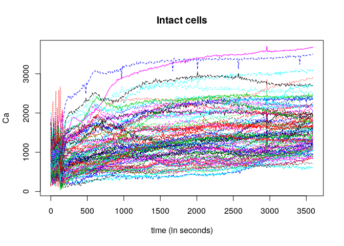

DD plot test
================

``` r
library(fda.usc)
```

    ## Loading required package: fda

    ## Loading required package: splines

    ## Loading required package: Matrix

    ## 
    ## Attaching package: 'fda'

    ## The following object is masked from 'package:graphics':
    ## 
    ##     matplot

    ## Loading required package: MASS

    ## Loading required package: mgcv

    ## Loading required package: nlme

    ## This is mgcv 1.8-28. For overview type 'help("mgcv-package")'.

    ## Loading required package: rpart

``` r
data(MCO)
plot(MCO$intact)
```

<!-- -->
